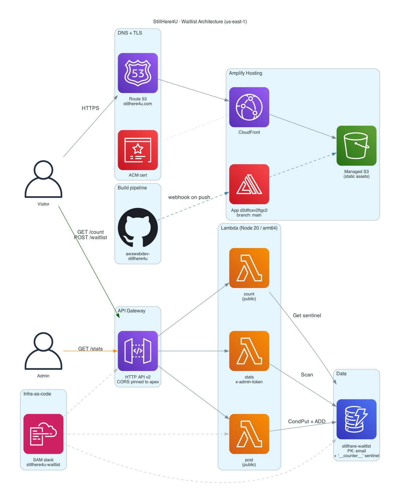

# StillHere4U — Waitlist Landing

Single-page waitlist for **[stillhere4u.com](https://stillhere4u.com)**.
React/Vite front-end on AWS Amplify Hosting, serverless back-end
(API Gateway HTTP API + Lambda + DynamoDB) deployed via SAM.

> *"Your voice, always on time."* — time-locked letters, voice stories,
> and video messages, delivered to the people you love at exactly the
> right moment in life.

---

## Table of contents

1. [Architecture](#1-architecture)
2. [Repository layout](#2-repository-layout)
3. [Local development](#3-local-development)
4. [Deploy — back-end (SAM)](#4-deploy--back-end-sam)
5. [Deploy — front-end (Amplify Hosting)](#5-deploy--front-end-amplify-hosting)
6. [Custom domain (Route 53)](#6-custom-domain-route-53)
7. [API contract](#7-api-contract)
8. [Admin stats page](#8-admin-stats-page)
9. [Security](#9-security)
10. [Cost](#10-cost)
11. [Operational runbook](#11-operational-runbook)

---

## 1. Architecture



> Regenerate with: `brew install graphviz && python3 -m venv /tmp/diagrams-venv && /tmp/diagrams-venv/bin/pip install diagrams && /tmp/diagrams-venv/bin/python docs/architecture.py`

### 1.1 Components

| Layer | AWS service | Resource / config |
|---|---|---|
| Domain | **Route 53** | hosted zone `stillhere4u.com` — apex `A-ALIAS`, `www CNAME`, ACM validation CNAME (Amplify-managed) |
| CDN + TLS | **Amplify Hosting** (wraps CloudFront + ACM) | app `d2dftcxv2ftgc2`, branch `main`, build env var `VITE_API_URL` |
| Front-end | **Vite + React 18** | hash-based router (`/` landing, `/#/stats` admin) — admin chunk lazy-loaded so the public bundle stays ~49 KB gzipped |
| API edge | **API Gateway HTTP API v2** | `0bp0skaab7.execute-api.us-east-1.amazonaws.com`; CORS pinned to `https://stillhere4u.com`; allows `x-admin-token` header |
| Compute | **Lambda × 3** | Node.js 20 / arm64; AWS SDK v3 from bundled runtime (no `node_modules` shipped) |
| Storage | **DynamoDB** | single table `stillhere-waitlist`, partition key `email`, plus one sentinel item for an atomic counter; PITR enabled |
| IaC | **AWS SAM** (CloudFormation under the hood) | stack `stillhere4u-waitlist`; `infra/template.yaml` + per-fn `CodeUri` |
| CI | **GitHub → Amplify webhook** | every push to `main` triggers a build job |
| Secrets | CloudFormation parameter | `AdminToken` (`NoEcho`, ≥16 chars), passed via `--parameter-overrides` on deploy |

### 1.2 Data flows

**Visitor lands on the page**
Browser resolves `stillhere4u.com` via Route 53 → CloudFront serves cached `index.html` + JS bundle from Amplify's managed S3. React mounts, fires `GET /api/waitlist/count` for the social-proof number, paints.

**Visitor signs up**
`POST /api/waitlist` with `{email, role, source}`. The `post` Lambda runs `PutItem` with `ConditionExpression: attribute_not_exists(email)` (idempotent), then `UpdateItem ADD count :1` on the `__counter__` sentinel, returns `{count, alreadySignedUp}`. UI swaps to the "You're in" state.

**Admin views stats**
`/#/stats` lazy-loads the admin chunk → user pastes admin token → `GET /api/waitlist/stats` with `x-admin-token` header. The `stats` Lambda compares the token against its `ADMIN_TOKEN` env var, scans the table (paginating `LastEvaluatedKey`), filters the sentinel, aggregates per-role counts, returns `{total, totals, signups}`. Front-end buckets the signups by day client-side and renders recharts + the table + CSV export.

**Code push**
`git push origin main` → GitHub webhook → Amplify build job runs `npm ci && npm run build` per `amplify.yml` → output uploaded to managed S3 → CloudFront invalidated → new bundle hash served immediately.

---

## 2. Repository layout

```
stillhere4u/
├── README.md                       ← you are here
├── amplify.yml                     ← Amplify Hosting build spec
├── index.html                      ← Vite entry HTML
├── vite.config.js
├── package.json
├── .env.example                    ← copy to .env.local for dev
├── docs/
│   ├── architecture.png            ← rendered diagram
│   └── architecture.py             ← reproducible source
├── src/
│   ├── main.jsx                    ← React root
│   ├── App.jsx                     ← hash router (/ vs /#/stats)
│   ├── api.js                      ← fetch helpers, reads VITE_API_URL
│   ├── stillhere_waitlist.jsx      ← landing page
│   └── stats_page.jsx              ← admin dashboard (lazy chunk)
└── infra/                          ← SAM back-end
    ├── template.yaml               ← table + API + 3 Lambdas
    ├── samconfig.toml              ← stack name, region, deploy bucket
    └── lambda/
        ├── waitlist-post/index.mjs
        ├── waitlist-count/index.mjs
        └── waitlist-stats/index.mjs
```

---

## 3. Local development

```bash
npm install
cp .env.example .env.local        # then fill VITE_API_URL with the SAM ApiUrl output
npm run dev                       # http://localhost:5173/
```

Note: the API CORS is locked to `https://stillhere4u.com`. Browser calls
from `localhost:5173` will be blocked by CORS — UI/visual review only.
To exercise the API end-to-end, either deploy to Amplify or temporarily
redeploy SAM with `--parameter-overrides AllowedOrigin='*'`.

---

## 4. Deploy — back-end (SAM)

Prerequisites: AWS CLI configured, [SAM CLI](https://docs.aws.amazon.com/serverless-application-model/latest/developerguide/install-sam-cli.html) installed.

```bash
cd infra
sam build

# First deploy — generate a strong admin token and pass it.
sam deploy --guided \
  --parameter-overrides AdminToken=$(openssl rand -hex 24)

# Save the AdminToken value — NoEcho means it isn't shown again.
# Subsequent deploys reuse stored params:
sam deploy
```

### Stack outputs

| Output | Where it's used |
|---|---|
| `ApiUrl` | Set as the `VITE_API_URL` Amplify env var |
| `TableName` | For ad-hoc DynamoDB queries, ops scripts, etc. |

### Updating parameters

To rotate the admin token, narrow CORS, or change the table name:

```bash
sam deploy --parameter-overrides \
  AllowedOrigin=https://stillhere4u.com \
  AdminToken=<new-48-char-hex>
```

---

## 5. Deploy — front-end (Amplify Hosting)

The Amplify app is connected to GitHub via OAuth (`admin:repo_hook` scope).
Every push to `main` triggers an auto-build per `amplify.yml`.

To bootstrap a fresh Amplify app from scratch:

```bash
# 1. Refresh the gh token with admin:repo_hook scope if needed
gh auth refresh -s admin:repo_hook -h github.com

# 2. Create the Amplify app
aws amplify create-app \
  --name stillhere4u \
  --repository https://github.com/<org>/awswebdev-stillhere4u \
  --access-token "$(gh auth token)" \
  --platform WEB \
  --environment-variables "VITE_API_URL=<from SAM output>" \
  --enable-branch-auto-build \
  --region us-east-1

# 3. Create the main branch
aws amplify create-branch --app-id <appId> --branch-name main \
  --stage PRODUCTION --enable-auto-build --region us-east-1

# 4. Trigger the first build
aws amplify start-job --app-id <appId> --branch-name main \
  --job-type RELEASE --region us-east-1
```

The first build typically completes in ~80 s.

---

## 6. Custom domain (Route 53)

Assuming the hosted zone already exists in the same AWS account:

```bash
aws amplify create-domain-association \
  --app-id <appId> \
  --domain-name stillhere4u.com \
  --sub-domain-settings prefix="",branchName=main prefix=www,branchName=main \
  --enable-auto-sub-domain --region us-east-1

# www → apex 301 redirect
aws amplify update-app --app-id <appId> --region us-east-1 \
  --custom-rules '[{"source":"https://www.stillhere4u.com","target":"https://stillhere4u.com","status":"301"}]'
```

Amplify auto-creates three records in Route 53:

1. **apex** `stillhere4u.com.` — `A` ALIAS to the Amplify CloudFront dist
2. **www** `www.stillhere4u.com.` — `CNAME` to the same CloudFront dist
3. **cert validation** `_<hash>.stillhere4u.com.` — `CNAME` for ACM

Provisioning takes ~3–10 min (ACM validation is the long pole). Poll with:

```bash
aws amplify get-domain-association --app-id <appId> \
  --domain-name stillhere4u.com --region us-east-1 \
  --query 'domainAssociation.domainStatus'
```

---

## 7. API contract

```
POST /api/waitlist
  Body: { "email": "you@example.com", "role": "Parent", "source": "landing-page" }
  200 : { "count": 42, "alreadySignedUp": false }
  400 : { "error": "invalid email" | "invalid role" | "invalid json" }

GET /api/waitlist/count
  200 : { "count": 42 }

GET /api/waitlist/stats        (admin)
  Header: x-admin-token: <AdminToken from SAM parameter>
  200 : {
          "total": 42,
          "totals": { "Parent": 12, "Child abroad": 4, ... },
          "signups": [ { email, role, timestamp, source }, ... ]
        }
  401 : { "error": "unauthorized" }
```

Allowed `role` values (match the chips on the landing page):
`Parent`, `Child abroad`, `Caregiver`, `Doctor`, `Insurance`, `Employer`, `Just curious`.

---

## 8. Admin stats page

Visit **`https://stillhere4u.com/#/stats`** (or `http://localhost:5173/#/stats`
in dev). A login form prompts for the admin token — paste the value you
set during `sam deploy`.

The token is kept in `sessionStorage` (cleared when the tab closes; survives
refreshes). The page shows:

- Total signup count and per-role breakdown (6 cards)
- 7-day stacked bar chart (recharts)
- Full signup table sorted newest-first
- CSV export button

To rotate the token, redeploy SAM with a new `AdminToken` value (section 4).

---

## 9. Security

| Concern | Mitigation |
|---|---|
| Anyone hitting the API | CORS pinned to `https://stillhere4u.com`; browser blocks cross-origin requests. Note CORS is *not* a server-side block — server-side callers can still hit the API. The admin endpoint adds token auth on top. |
| Stats endpoint exposure | `x-admin-token` header required; Lambda compares to `ADMIN_TOKEN` env var (loaded from CFN `NoEcho` parameter; never in git). |
| Lambda over-permission | Each function has its own IAM role using SAM policy templates: `DynamoDBCrudPolicy` for `post`, `DynamoDBReadPolicy` for `count` and `stats`. No `*` actions or resources. |
| Duplicate signups | `PutItem` with `attribute_not_exists(email)` — second submission returns `200 { alreadySignedUp: true }` without incrementing the counter. |
| Data at rest | DynamoDB encrypted by default; PITR provides 35-day recovery. |
| Data in flight | TLS end-to-end (Amplify-managed ACM cert + API Gateway TLS). |
| Source provenance | Private GitHub repo; Amplify build runs in AWS-managed isolated build env. |

### Counter-atomicity caveat

The signup flow is `ConditionalPutItem` followed by `UpdateItem ADD`. If the
Lambda dies between those two ops, the visible count can drift one below
reality. To guarantee strict atomicity, swap the two operations for a
`TransactWriteItems`. Not done by default — low-volume waitlist, the trade-off
isn't worth the extra cost yet.

---

## 10. Cost

At MVP traffic (single-digit signups/day, hundreds of visitors/day):

| Service | Est. monthly |
|---|---|
| Route 53 (hosted zone) | $0.50 |
| Amplify Hosting | within free tier (5 GB storage, 15 GB transfer) |
| API Gateway HTTP API | < $0.10 (≪ 1 M requests) |
| Lambda | within free tier |
| DynamoDB (on-demand) | < $0.10 |
| ACM cert | $0.00 |
| CloudWatch Logs | < $0.50 |
| **Total** | **≈ $1–2 / month** |

Costs scale roughly linearly with request volume; at 1 M monthly visits
you'd still be under $25/month dominated by Amplify Hosting data transfer.

---

## 11. Operational runbook

### Smoke tests

```bash
API=https://0bp0skaab7.execute-api.us-east-1.amazonaws.com

# Public count
curl -sS $API/api/waitlist/count

# Stats (admin token required)
curl -sS -H "x-admin-token: <token>" $API/api/waitlist/stats | jq .

# CORS lock — should return headers only for apex origin
curl -sSI -X OPTIONS $API/api/waitlist \
  -H "Origin: https://stillhere4u.com" \
  -H "Access-Control-Request-Method: POST" \
  -H "Access-Control-Request-Headers: content-type"
```

### Tail Lambda logs

```bash
aws logs tail /aws/lambda/stillhere4u-waitlist-post   --follow --region us-east-1
aws logs tail /aws/lambda/stillhere4u-waitlist-count  --follow --region us-east-1
aws logs tail /aws/lambda/stillhere4u-waitlist-stats  --follow --region us-east-1
```

### Inspect raw signups

```bash
aws dynamodb scan --table-name stillhere-waitlist --region us-east-1 \
  --filter-expression "email <> :c" \
  --expression-attribute-values '{":c":{"S":"__counter__"}}' \
  --output json | jq '.Items'
```

### Reset counter (if it drifts)

```bash
# Recount manually
N=$(aws dynamodb scan --table-name stillhere-waitlist --region us-east-1 \
    --filter-expression "email <> :c" \
    --expression-attribute-values '{":c":{"S":"__counter__"}}' \
    --select COUNT --query 'Count' --output text)

aws dynamodb update-item --table-name stillhere-waitlist --region us-east-1 \
  --key '{"email":{"S":"__counter__"}}' \
  --update-expression "SET #c = :n" \
  --expression-attribute-names '{"#c":"count"}' \
  --expression-attribute-values "{\":n\":{\"N\":\"$N\"}}"
```

### Roll back a bad front-end deploy

In the Amplify console (Hosting → main branch), each build has a "Redeploy this
version" button. Pick the previous green build to revert without a git revert.

---

## Acknowledgements

Built with Claude Code (Anthropic) on AWS Amplify, Lambda, API Gateway, and
DynamoDB. Diagram: [mingrammer/diagrams](https://github.com/mingrammer/diagrams).
